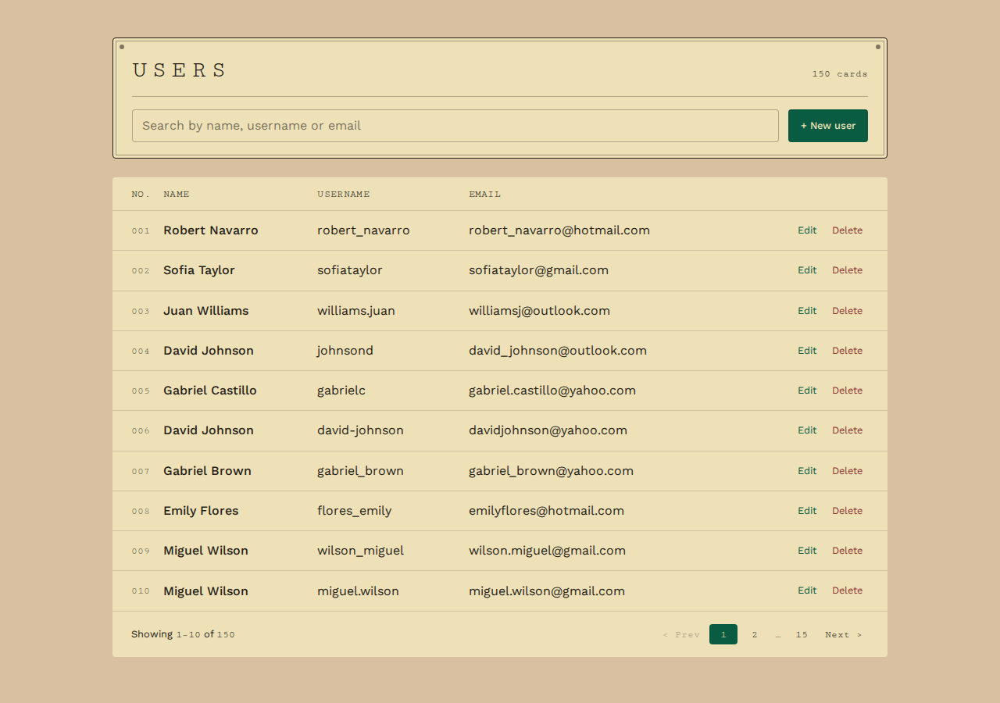
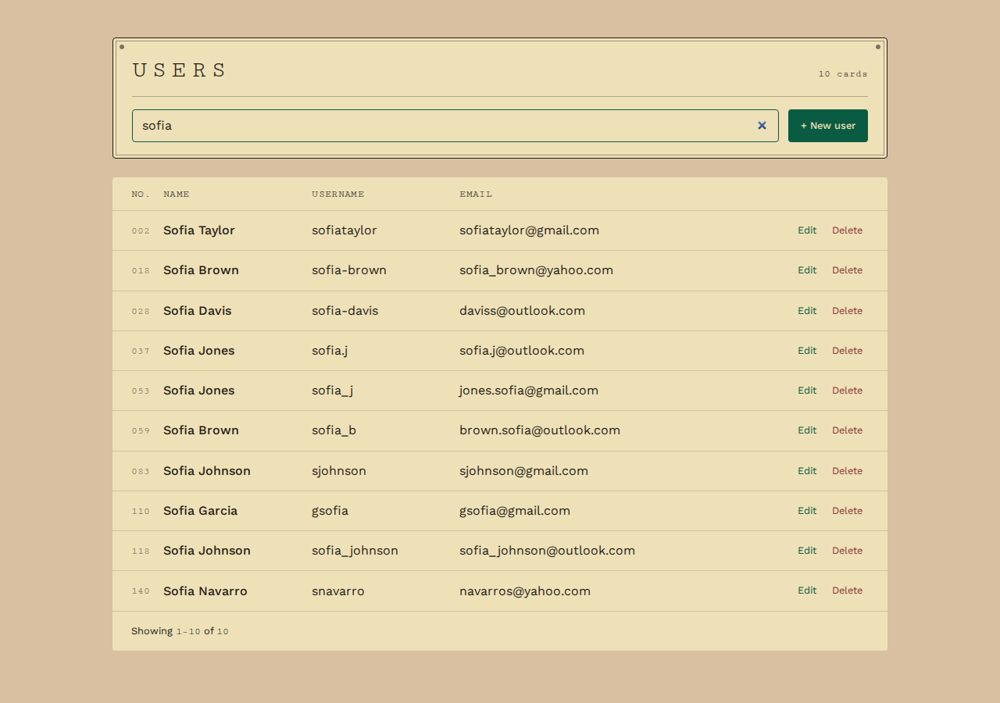
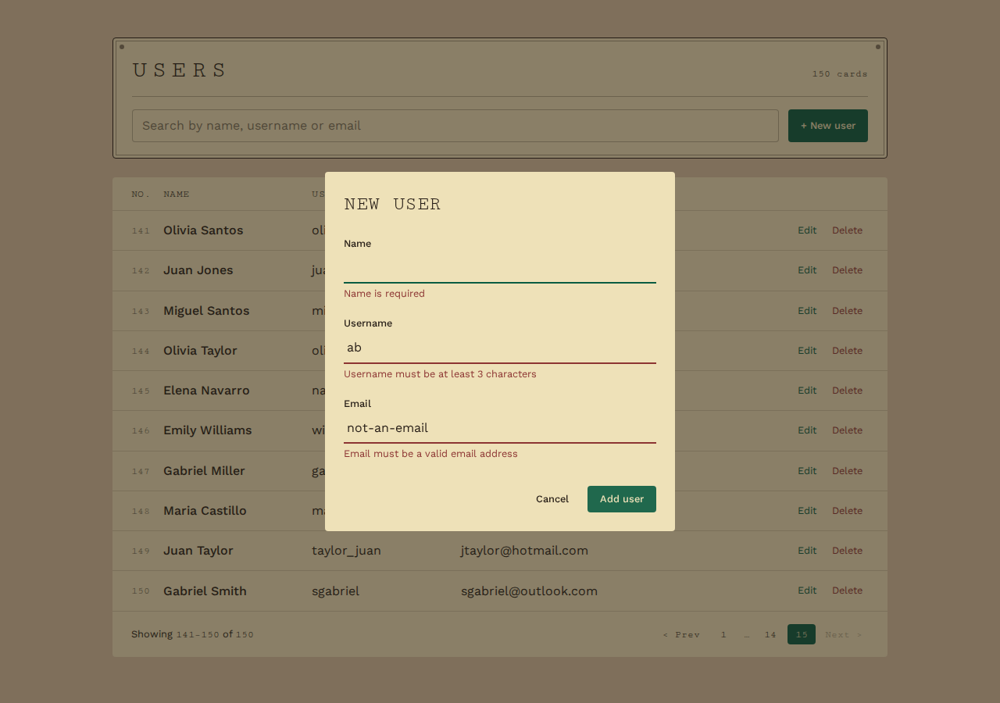
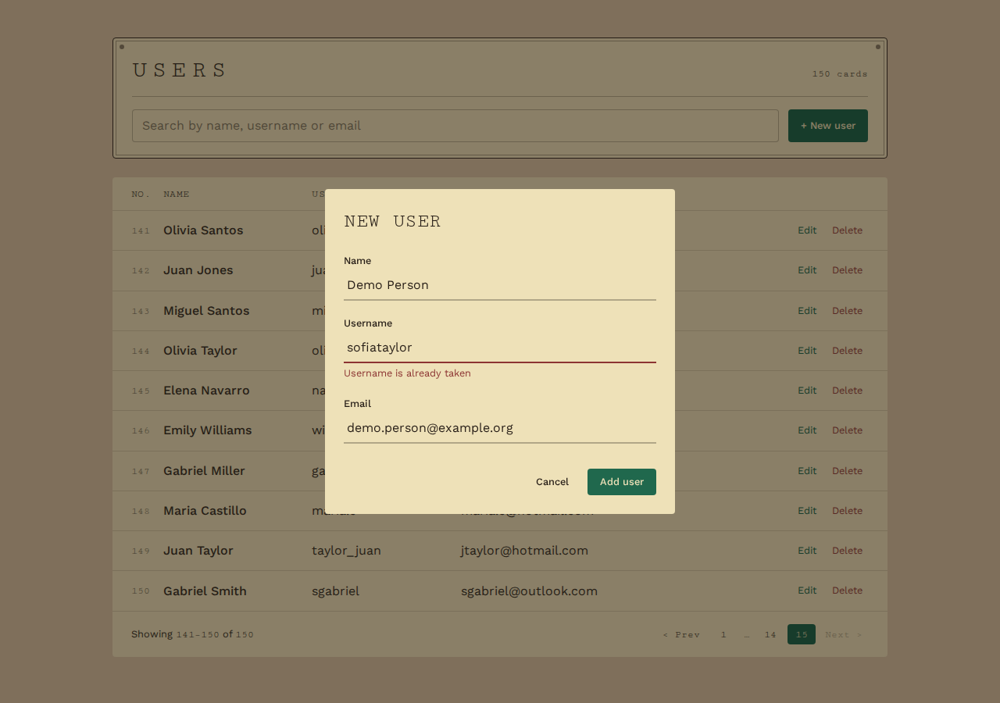
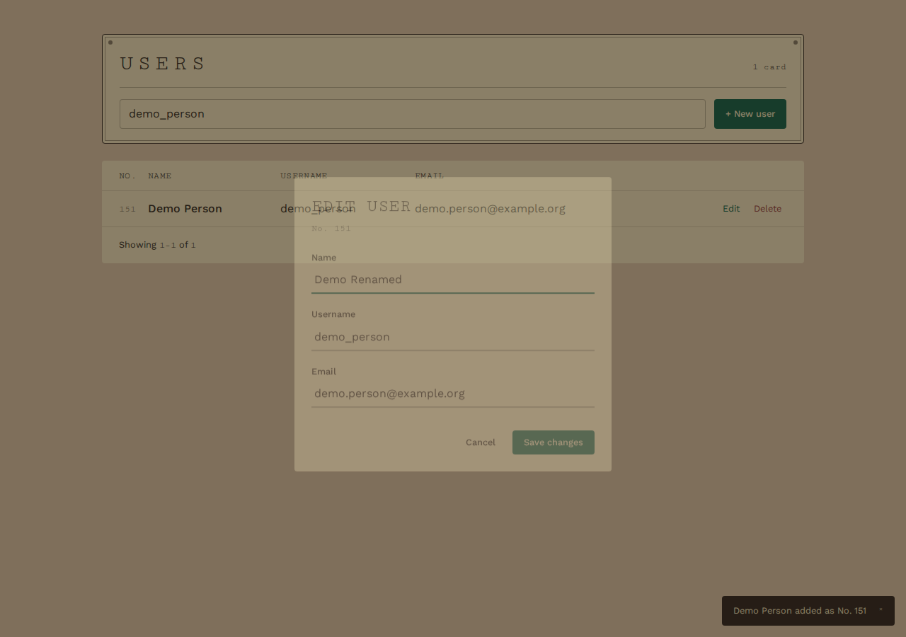
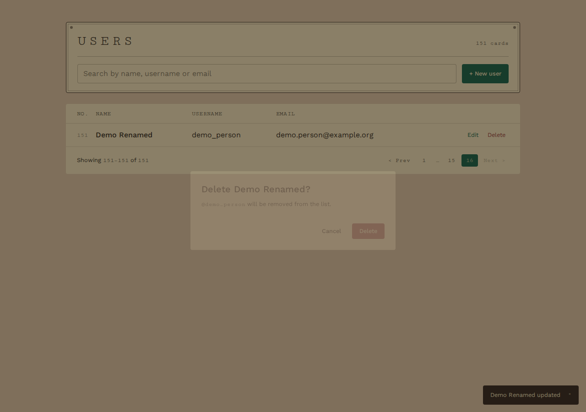
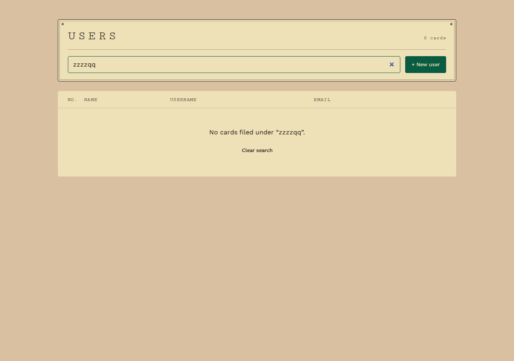
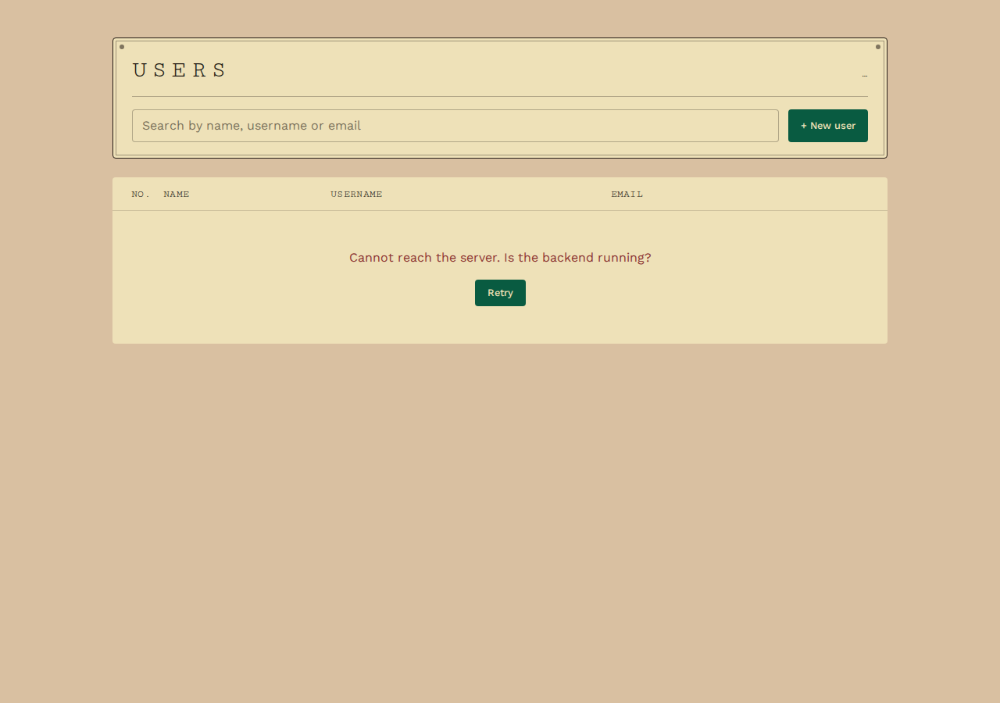
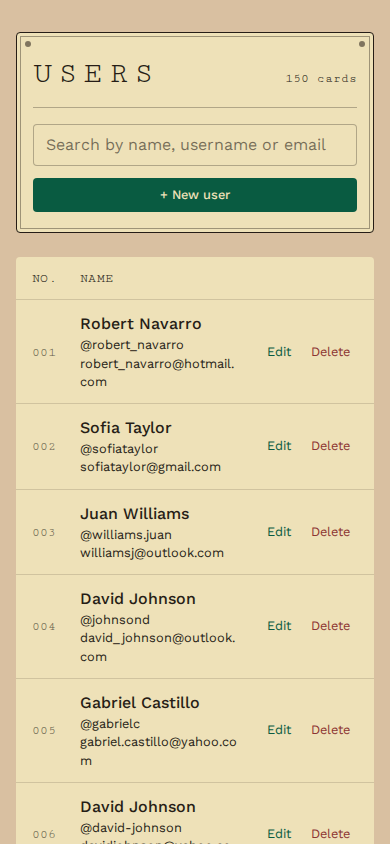

# User Management Dashboard

A small dashboard for listing, searching, creating, updating and deleting users.

- **Frontend:** React + Vite + Tailwind CSS (`/frontend`)
- **Backend:** Node.js + Express REST API (`/backend`)
- **Storage:** a JSON file, `backend/data/user.json` (no database)

## Prerequisites

- [Node.js](https://nodejs.org/) **20.19+ or 22.12+** (includes `npm`). Check with `node -v`.
- Python 3, only if you want to regenerate the sample data (optional).

## Getting started

Clone the repository, then from the project root:

```bash
npm start
```

This starts the API and the frontend together. The first run installs all dependencies automatically (root, `backend` and `frontend`), and so does any run after a `package-lock.json` changes. To install without starting, run `npm run setup`.

Open **http://localhost:5173** in your browser. Logs from both are shown in one terminal, prefixed `[api]` and `[web]`. `Ctrl+C` stops both.

### Running them separately

If you prefer two terminals, start each app on its own.

#### 1. Backend

```bash
cd backend
npm install
npm run dev
```

The API runs at **http://localhost:3001**. You should see:

```
API listening on http://localhost:3001 (data: .../backend/data/user.json)
```

#### 2. Frontend

```bash
cd frontend
npm install
npm run dev
```

Open **http://localhost:5173** in your browser.

The frontend forwards every `/api/...` request to the backend on port 3001, so the backend must be running for the app to load data.

## Configuration

The backend reads two optional environment variables:

| Variable    | Default                  | Purpose                        |
|-------------|--------------------------|--------------------------------|
| `PORT`      | `3001`                   | Port the API listens on        |
| `DATA_FILE` | `backend/data/user.json` | JSON file users are stored in  |

Example: run the API against a scratch copy of the data, so your changes don't touch the original file:

```bash
cp data/user.json /tmp/users.json
DATA_FILE=/tmp/users.json npm run dev
```

If you change `PORT`, also update the proxy target in `frontend/vite.config.js`.

## Data

- The app starts with 150 sample users from `backend/data/user.json`.
- Creating, updating and deleting users **writes to that file**.
- To restore the original data:

  ```bash
  git checkout -- backend/data/user.json
  ```

- To generate a fresh set of sample users (overwrites the file; 1–200 users):

  ```bash
  python3 scripts/data_seeder.py 150 backend/data/user.json
  ```

- **Deleting is a soft delete.** A deleted user stays in the file with `"deleted": true`, is hidden everywhere in the API, and its id is never reused.

## API reference

Base URL: `http://localhost:3001/api/users`

| Method   | Endpoint          | Success        | Description                  |
|----------|-------------------|----------------|------------------------------|
| `GET`    | `/api/users`      | `200`          | List and search users        |
| `GET`    | `/api/users/:id`  | `200`          | Get one user                 |
| `POST`   | `/api/users`      | `201`          | Create a user                |
| `PUT`    | `/api/users/:id`  | `200`          | Replace a user's details     |
| `DELETE` | `/api/users/:id`  | `204` (no body)| Delete a user                |

### Listing and searching: `GET /api/users`

All query parameters are optional and can be combined.

| Parameter  | Example          | Meaning                                                        |
|------------|------------------|----------------------------------------------------------------|
| `q`        | `?q=maria`       | Matches name, username **or** email (case-insensitive, partial) |
| `name`     | `?name=maria`    | Name contains the text                                         |
| `username` | `?username=mar`  | Username contains the text                                     |
| `email`    | `?email=gmail`   | Email contains the text                                        |
| `id`       | `?id=42`         | Exact id                                                       |
| `page`     | `?page=2`        | Page number, starting at 1 (default `1`)                       |
| `limit`    | `?limit=20`      | Users per page, 1–100 (default `50`)                           |

When several filters are given, a user must match **all** of them.

Response:

```json
{
  "data": [
    { "name": "Sofia Taylor", "username": "sofiataylor", "email": "sofiataylor@gmail.com", "id": 2 }
  ],
  "page": 1,
  "limit": 50,
  "total": 43,
  "totalPages": 1
}
```

`total` is the number of users matching the filters, across all pages.

### Creating and updating: `POST` and `PUT`

Send a JSON body with the header `Content-Type: application/json`. All three fields are required for both create and update.

```json
{ "name": "Ana Cruz", "username": "ana.cruz", "email": "ana@example.com" }
```

| Field      | Rules                                                                 |
|------------|-----------------------------------------------------------------------|
| `name`     | 1–100 characters                                                      |
| `username` | 3–30 characters: letters, digits, `.`, `_`, `-`. Must be unique.       |
| `email`    | A valid email address, up to 254 characters. Must be unique. Stored in lowercase. |

Leading and trailing spaces are removed. Uniqueness ignores upper/lower case. Do not send `id`; the server assigns it.

Example:

```bash
curl -X POST http://localhost:3001/api/users \
  -H "Content-Type: application/json" \
  -d '{"name":"Ana Cruz","username":"ana.cruz","email":"ana@example.com"}'
```

### Errors

Every error has the same JSON shape. `details` appears when specific fields or parameters are at fault:

```json
{
  "error": "Invalid user data",
  "details": { "username": "must be at least 3 characters", "email": "is required" }
}
```

| Status | When                                                                      |
|--------|---------------------------------------------------------------------------|
| `400`  | Invalid body, query parameter or id; malformed JSON                       |
| `404`  | No user with that id (or it was deleted); unknown URL                     |
| `405`  | Method not supported on that URL (the `Allow` header lists the valid ones) |
| `409`  | Username or email already belongs to another user                         |
| `413`  | Request body larger than 100 KB                                           |
| `500`  | Server-side problem, e.g. the data file is missing or corrupt             |

## Project structure

```
backend/
  data/user.json        user data (seed + saved changes)
  src/
    server.js           entry point: reads config, starts the server
    app.js              Express app: middleware and routes
    routes/             URL → handler mapping
    controllers/        request handling for each endpoint
    models/user.js      the user's fields and their rules
    validators/         checks for request bodies, query parameters and ids
    services/           reading and writing the JSON file
    middleware/         error responses, 404 and 405 handling
frontend/
  src/
    api/usersApi.js     the only code that calls the backend; errors become ApiError
    validation/         client-side copy of the backend's field rules
    hooks/              useUsersQuery (fetch a page), useDebouncedValue (search), useToasts
    components/         LabelPlate, SearchBar, UserTable, UserRow, Pagination,
                        Modal, UserFormDialog, ConfirmDeleteDialog, Button
    App.jsx             page state (search, page, open dialog) and CRUD handlers
scripts/
  data_seeder.py        generates sample users
```

## Frontend features

- **List** of users (10 per page) with numbered pagination.
- **Search** as you type across name, username and email. Runs on the server, 300 ms after you stop typing; a new search starts at page 1.
- **Create and edit** in one form dialog. Fields are checked as you leave them and again on save, using the same rules as the API. Errors the server reports (e.g. a username already taken) appear on the matching field.
- **Delete** asks for confirmation first.
- Loading placeholders, an empty-search message, an error message with **Retry** when the API can't be reached, and a short message after every create, update and delete.
- Works with the keyboard alone (Esc closes dialogs) and on phone-sized screens.

## Screenshots

| | |
|---|---|
|  User list |  Search |
|  Form checks before sending |  Error returned by the server |
|  Edit |  Delete confirmation |
|  No results |  API unreachable |


